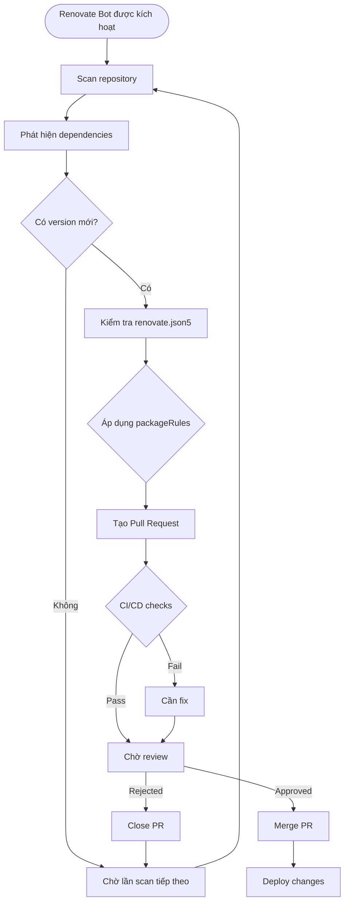
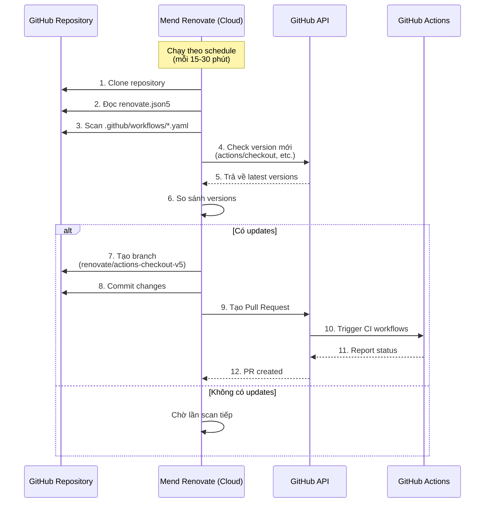
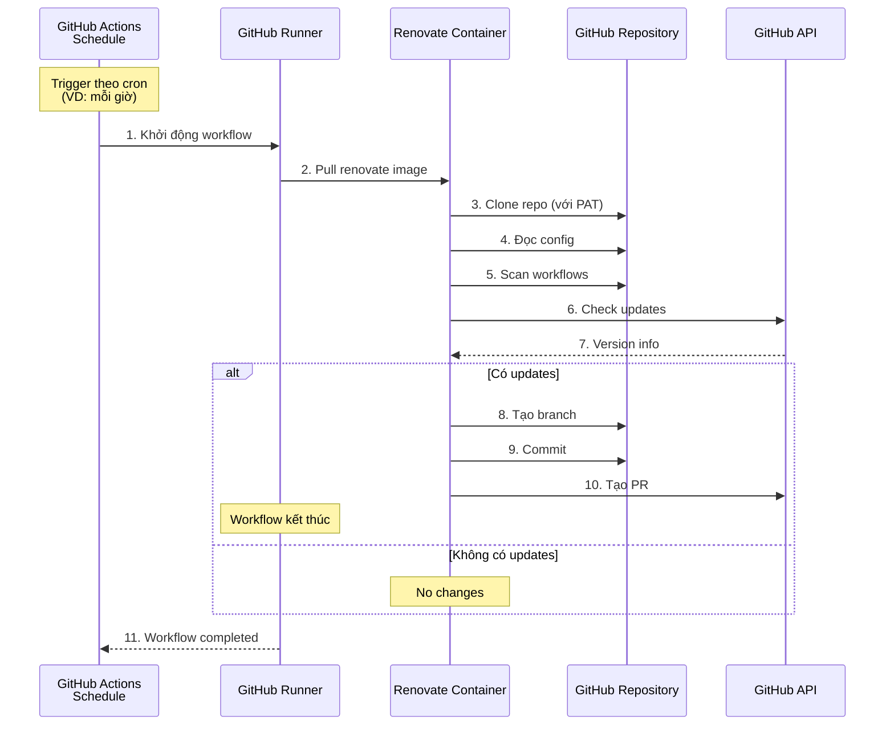
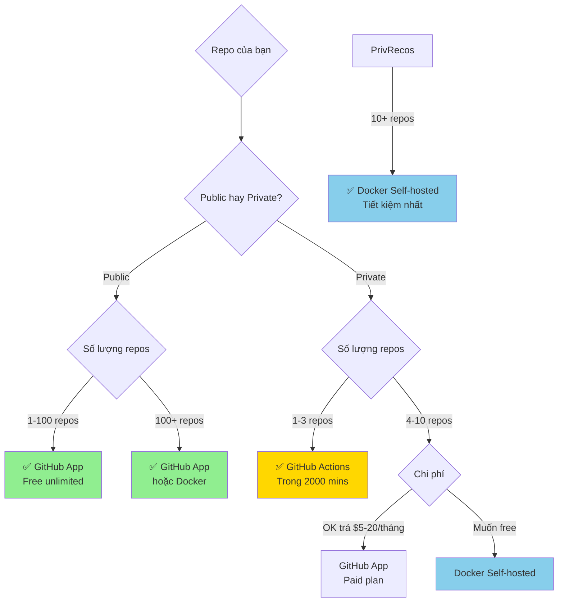

# Renovate App - Dependency Update Automation

> 📖 **Language:** [Tiếng Việt](README.md) | [English](DOCS.md)

Repository demo để setup và test Renovate bot cho việc tự động cập nhật GitHub Actions dependencies.

## 📋 Mục lục

- [Flow hoạt động](#-flow-hoạt-động)
- [Cấu hình hiện tại](#️-cấu-hình-hiện-tại)
- [So sánh: GitHub App vs Self-hosted](#-so-sánh-github-app-vs-self-hosted)
- [Setup Guide](#-setup-guide)
- [Troubleshooting](#-troubleshooting)

---

## 🔄 Flow hoạt động

### Flow tổng quan của Renovate



### Flow chi tiết: GitHub App (Mend Renovate)



### Flow chi tiết: Self-hosted với GitHub Actions



### Workflow dependencies được quản lý

```mermaid
graph LR
    subgraph "Repository"
        A[.github/workflows/ci.yaml]
        B[.github/workflows/docker.yaml]
    end
    
    subgraph "Renovate Scans"
        A --> A1[actions/checkout@v4]
        A --> A2[actions/setup-node@v4]
        A --> A3[pnpm/action-setup@v3]
        
        B --> B1[actions/checkout@v4]
        B --> B2[docker/setup-buildx-action@v3]
        B --> B3[docker/build-push-action@v5]
    end
    
    subgraph "Renovate Actions"
        A1 --> PR1[PR: Update to v5]
        A2 --> PR2[PR: Update if available]
        A3 --> PR3[PR: Pin digest + update]
        B2 --> PR4[PR: Update to v4]
        B3 --> PR5[PR: Update to v6]
    end
    
    style PR1 fill:#90EE90
    style PR2 fill:#FFD700
    style PR3 fill:#87CEEB
    style PR4 fill:#90EE90
    style PR5 fill:#FFD700
```

---

## ⚙️ Cấu hình hiện tại

### File: `renovate.json5`

```json5
{
  // Kế thừa config base từ Cybozu
  extends: ["github>cybozu/renovate-config", ":prConcurrentLimitNone"],
  
  // CHỈ enable GitHub Actions manager
  enabledManagers: ["github-actions"],
  
  packageRules: [
    {
      description: "Disable automerge for all GitHub Actions updates (require manual review)",
      matchManagers: ["github-actions"],
      automerge: false,
    },
  ],
}
```

### Cách hoạt động:

| Cấu hình | Giải thích | Ảnh hưởng |
|----------|-----------|-----------|
| `extends: ["github>cybozu/renovate-config"]` | Kế thừa config base từ Cybozu | Pin digests cho third-party actions, timezone Asia/Tokyo |
| `:prConcurrentLimitNone` | Không giới hạn số PR đồng thời | Có thể tạo nhiều PR update cùng lúc |
| `enabledManagers: ["github-actions"]` | **Chỉ** quét GitHub Actions | Bỏ qua npm, Docker, terraform, etc. |
| `automerge: false` | Tắt automerge | Tất cả PR cần review thủ công |

### Dependencies được quản lý:

✅ **Sẽ được update:**
```yaml
# ci.yaml
- uses: actions/checkout@v4           # → v5 khi có
- uses: actions/setup-node@v4         # → v5 khi có
- uses: pnpm/action-setup@v3          # → pin digest + update

# docker.yaml
- uses: actions/checkout@v4           # → v5 khi có
- uses: docker/setup-buildx-action@v3 # → v4 khi có
- uses: docker/build-push-action@v5   # → v6 khi có
```

❌ **Sẽ KHÔNG được quản lý** (do chỉ enable github-actions):
- `package.json` dependencies
- `Dockerfile` base images
- `docker-compose.yml` images
- Terraform modules

---

## 📊 So sánh: GitHub App vs Self-hosted

### Bảng so sánh tổng quan

| Tiêu chí | GitHub App (Mend) | GitHub Actions Self-hosted | Docker Self-hosted | 📚 References |
|----------|-------------------|---------------------------|-------------------|---------------|
| **💰 Chi phí** | ✅ Free (public)<br>💰 Paid (private) | ✅ Free (public unlimited)<br>✅ 2000 mins/tháng (private)<br>💰 $0.008/min vượt quota | ✅ Free<br>💰 Server cost | [GitHub Pricing](https://docs.github.com/en/billing/managing-billing-for-github-actions/about-billing-for-github-actions)<br>[Mend Pricing](https://www.mend.io/renovate/) |
| **🔧 Setup** | ✅ **3 clicks**<br>No code | ⚠️ Medium<br>Cần workflow + PAT | ⚠️ Complex<br>Cần config + infra | [Mend Install](https://github.com/apps/renovate)<br>[GitHub Action](https://github.com/renovatebot/github-action)<br>[Self-hosting](https://docs.renovatebot.com/self-hosting/) |
| **⚙️ Infrastructure** | ✅ Không cần<br>Mend hosted | ✅ GitHub runners | ❌ Cần server 24/7 | [Runners](https://docs.github.com/en/actions/using-github-hosted-runners) |
| **🔐 Authentication** | ✅ Auto OAuth | ⚠️ PAT manual | ⚠️ PAT manual | [PAT Guide](https://docs.github.com/en/authentication/keeping-your-account-and-data-secure/creating-a-personal-access-token) |
| **📈 Scale** | ✅ **Unlimited repos**<br>1-click enable | ⚠️ 1 workflow/repo | ✅ Unlimited<br>Autodiscover | [Autodiscover](https://docs.renovatebot.com/self-hosting/#autodiscover) |
| **⏱️ Frequency** | ✅ ~15-30 phút | ⚠️ Theo cron<br>(mỗi giờ, ngày) | ✅ Tuỹ chỉnh | [Cron Schedule](https://docs.github.com/en/actions/using-workflows/events-that-trigger-workflows#schedule) |
| **🎛️ Dashboard** | ✅ **Web UI đẹp**<br>Settings, logs, insights | ❌ Không có<br>Chỉ Actions logs | ❌ Không có | [Mend Dashboard](https://developer.mend.io/) |
| **🐛 Debugging** | ⚠️ Khó<br>Via dashboard | ✅ Dễ<br>Actions logs | ✅ **Dễ nhất**<br>Full logs | [Debug Guide](https://docs.renovatebot.com/troubleshooting/) |
| **🔒 Security** | ⚠️ Third-party | ✅ Tốt<br>Secrets encrypted | ✅ **Tốt nhất**<br>Full control | [Security](https://docs.github.com/en/actions/security-guides) |
| **🌐 Platforms** | ✅ GitHub, GitLab,<br>Bitbucket, Azure | ❌ GitHub only | ✅ All platforms | [Platforms](https://docs.renovatebot.com/modules/platform/) |
| **📊 Usage Limits** | ⚠️ Mend limits | ⚠️ **2000 mins/tháng**<br>(private repos) | ✅ No limits<br>(except API) | [Usage Limits](https://docs.github.com/en/billing/managing-billing-for-github-actions/about-billing-for-github-actions#usage-limits) |
| **🎨 Customization** | ⚠️ Config file only | ✅ Workflow customizable | ✅ **Fully flexible** | [Config Options](https://docs.renovatebot.com/configuration-options/) |
| **👥 Multi-repo** | ✅ **Best**<br>Bulk enable | ❌ Copy workflow | ✅ Good<br>Single job | [Multi-repo](https://docs.renovatebot.com/self-hosting/#repositories) |

### Chi phí chi tiết: GitHub Actions

#### ✅ Public Repositories:
```
✓ UNLIMITED minutes - Hoàn toàn miễn phí
✓ Không giới hạn dù chạy 24/7
```

#### ⚠️ Private Repositories:

| Plan | Free Minutes | Giá vượt quota | Storage |
|------|-------------|---------------|---------|
| Free | 2,000 mins/tháng | $0.008/min | 500 MB |
| Pro | 3,000 mins/tháng | $0.008/min | 1 GB |
| Team | 3,000 mins/tháng | $0.008/min | 2 GB |
| Enterprise | 50,000 mins/tháng | $0.008/min | 50 GB |

📚 **Reference:** [GitHub Actions Billing](https://docs.github.com/en/billing/managing-billing-for-github-actions/about-billing-for-github-actions)

#### 💵 Ví dụ tính chi phí:

**Scenario 1: 1 private repo, chạy mỗi giờ**
```
Mỗi lần chạy: 5 phút
Chạy/ngày: 24 lần
Chạy/tháng: 24 × 30 = 720 lần
Tổng minutes: 720 × 5 = 3,600 phút

Free tier: 2,000 phút
Vượt quota: 3,600 - 2,000 = 1,600 phút
Chi phí: 1,600 × $0.008 = $12.80/tháng
```

**Scenario 2: 5 private repos, chạy mỗi 6 giờ**
```
Mỗi repo: 4 lần/ngày
5 repos: 4 × 5 × 30 = 600 lần/tháng
Tổng minutes: 600 × 5 = 3,000 phút

Free tier: 2,000 phút
Vượt quota: 1,000 phút
Chi phí: 1,000 × $0.008 = $8/tháng
```

#### 💡 Cách tiết kiệm:

```yaml
# Thay vì mỗi giờ (720 lần/tháng):
- cron: '0 * * * *'

# Chạy mỗi 6 giờ (120 lần/tháng - tiết kiệm 83%):
- cron: '0 */6 * * *'

# Chỉ ngày làm việc (22 lần/tháng - tiết kiệm 97%):
- cron: '0 9 * * 1-5'
```

---

## 🎯 Khi nào dùng phương pháp nào?



### ✅ Dùng GitHub App (Mend) khi:
- ✨ Public repos (miễn phí unlimited)
- 🏢 Nhiều repos (5+) cần enable nhanh
- 👥 Team/Organization
- 🚀 Muốn setup nhanh, không maintain
- 📊 Cần dashboard đẹp
- ⏱️ Cần real-time updates

### ✅ Dùng GitHub Actions khi:
- 💰 Ít repos (1-5) private
- ⚖️ Balance giữa dễ setup và control
- 📈 Trong limit 2000 minutes/tháng
- 🔐 Muốn tự quản lý token

### ✅ Dùng Docker Self-hosted khi:
- 🏢 Enterprise, nhiều repos (10+)
- 🌐 Multi-platform (GitHub + GitLab)
- 🛡️ Security strict (on-premise)
- 📊 Chạy thường xuyên (mỗi 15 phút)
- 💪 Có infrastructure sẵn

---

## 🚀 Setup Guide

### Option 1: GitHub App (Recommended)

1. **Install Mend Renovate App:**
   ```
   https://github.com/apps/renovate
   ```

2. **Grant permissions:**
   - Select repositories
   - Grant read/write access

3. **Configure settings:**
   - Visit: https://developer.mend.io/
   - Enable "Dependency Updates"
   - Enable "Automated PRs"
   - Enable "Create onboarding PRs"

4. **Add config file** (đã có `renovate.json5`)

5. **Wait for Renovate:**
   - Onboarding PR sẽ xuất hiện trong ~15 phút
   - Sau khi merge, Renovate sẽ scan và tạo PR updates

📚 **Docs:** https://docs.renovatebot.com/getting-started/installing-onboarding/

---

### Option 2: GitHub Actions Self-hosted

1. **Tạo Personal Access Token:**
   ```
   GitHub Settings → Developer settings → Personal access tokens
   → Generate new token (classic)
   
   Scopes cần thiết:
   ✓ repo (full)
   ✓ workflow
   ```

2. **Add token to repository secrets:**
   ```
   Repository Settings → Secrets and variables → Actions
   → New repository secret
   
   Name: RENOVATE_TOKEN
   Value: ghp_xxxxxxxxxxxxx
   ```

3. **Tạo workflow file:**

```yaml
# .github/workflows/renovate.yml
name: Renovate

on:
  schedule:
    # Chạy mỗi 6 giờ
    - cron: '0 */6 * * *'
  workflow_dispatch:
    # Cho phép chạy thủ công

jobs:
  renovate:
    runs-on: ubuntu-latest
    steps:
      - name: Checkout
        uses: actions/checkout@v4

      - name: Self-hosted Renovate
        uses: renovatebot/github-action@v40.3.2
        with:
          configurationFile: renovate.json5
          token: ${{ secrets.RENOVATE_TOKEN }}
        env:
          RENOVATE_REPOSITORIES: ${{ github.repository }}
          LOG_LEVEL: debug
```

4. **Commit và push:**
   ```bash
   git add .github/workflows/renovate.yml
   git commit -m "chore: add self-hosted renovate workflow"
   git push
   ```

5. **Test:**
   - Vào tab "Actions"
   - Chọn workflow "Renovate"
   - Click "Run workflow"

📚 **Docs:** https://github.com/renovatebot/github-action

---

### Option 3: Docker Self-hosted

1. **Tạo config file:**

```javascript
// config.js
module.exports = {
  platform: 'github',
  endpoint: 'https://api.github.com/',
  token: process.env.GITHUB_TOKEN,
  
  repositories: ['thuan-ngo/renovate-app'],
  
  onboarding: true,
  requireConfig: 'optional',
  
  gitAuthor: 'Renovate Bot <bot@renovateapp.com>',
  
  logLevel: 'info',
  logFile: 'renovate.log',
};
```

2. **Chạy với Docker:**

```bash
docker run --rm \
  -e GITHUB_TOKEN=ghp_xxxxxxxxxxxxx \
  -e LOG_LEVEL=debug \
  -v $(pwd)/config.js:/usr/src/app/config.js \
  renovate/renovate:latest
```

3. **Setup cron job (optional):**

```bash
# Tạo script
cat > ~/renovate-run.sh << 'EOF'
#!/bin/bash
docker run --rm \
  -e GITHUB_TOKEN=ghp_xxxxxxxxxxxxx \
  -v ~/renovate-config.js:/usr/src/app/config.js \
  renovate/renovate:latest
EOF

chmod +x ~/renovate-run.sh

# Add to crontab (mỗi 6 giờ)
crontab -e
0 */6 * * * ~/renovate-run.sh >> ~/renovate.log 2>&1
```

📚 **Docs:** https://docs.renovatebot.com/self-hosting/

---

## 🔍 Troubleshooting

### ❌ Vấn đề: Renovate không tạo PR

**Nguyên nhân có thể:**

1. **Workflows không ở đúng vị trí:**
   ```bash
   # Sai:
   workflows/ci.yaml
   
   # Đúng:
   .github/workflows/ci.yaml
   ```

2. **Không có updates cần thiết:**
   - Kiểm tra: Tất cả actions đã là version mới nhất
   - Solution: Đợi version mới hoặc test bằng downgrade version

3. **Config file sai:**
   ```bash
   # Test config locally
   npm install -g renovate
   renovate --dry-run=full thuan-ngo/renovate-app
   ```

4. **Onboarding PR chưa được merge:**
   - Tìm PR "Configure Renovate"
   - Merge hoặc close nó

5. **Repository không được enable:**
   - Check: https://developer.mend.io/
   - Enable "Dependency Updates"

### ❌ Vấn đề: GitHub Actions workflow không chạy

**Check:**

1. **Token có đúng permissions:**
   ```
   ✓ repo (full control)
   ✓ workflow
   ```

2. **Secret đã được add:**
   ```
   Settings → Secrets → Actions → RENOVATE_TOKEN
   ```

3. **Cron syntax đúng:**
   ```yaml
   # Đúng:
   - cron: '0 */6 * * *'
   
   # Sai:
   - cron: '0 6 * * *'  # Chỉ chạy 1 lần/ngày
   ```

4. **Check logs:**
   ```
   Actions tab → Renovate workflow → Latest run → Logs
   ```

### ❌ Vấn đề: PR được tạo nhưng CI fails

**Solutions:**

1. **Fix CI workflow:**
   - Ensure dependencies installed
   - Fix test commands

2. **Allow CI to run on Renovate PRs:**
   ```yaml
   on:
     pull_request:
       branches: ['**']  # Allow all branches
   ```

---

## 📚 Tài liệu tham khảo

### Official Docs:
- **Renovate Docs:** https://docs.renovatebot.com/
- **GitHub Actions:** https://docs.github.com/en/actions
- **Mend Renovate:** https://www.mend.io/renovate/

### Configuration:
- **Configuration Options:** https://docs.renovatebot.com/configuration-options/
- **GitHub Actions Manager:** https://docs.renovatebot.com/modules/manager/github-actions/
- **Package Rules:** https://docs.renovatebot.com/configuration-options/#packagerules

### Self-hosting:
- **Self-hosting Guide:** https://docs.renovatebot.com/self-hosting/
- **GitHub Action:** https://github.com/renovatebot/github-action
- **Docker Hub:** https://hub.docker.com/r/renovate/renovate

### Pricing:
- **GitHub Actions Pricing:** https://docs.github.com/en/billing/managing-billing-for-github-actions/about-billing-for-github-actions
- **Mend Pricing:** https://www.mend.io/renovate/

### Community:
- **Discussions:** https://github.com/renovatebot/renovate/discussions
- **Issues:** https://github.com/renovatebot/renovate/issues

---

## 📝 License

MIT

---

## 🤝 Contributing

Pull requests are welcome!

---

**Last updated:** October 2025
