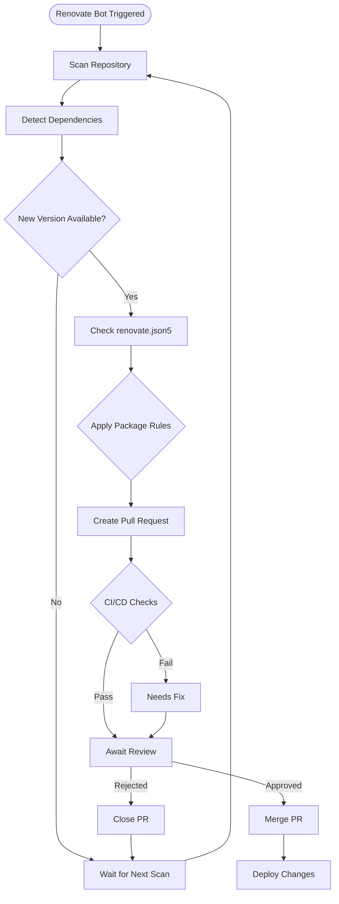
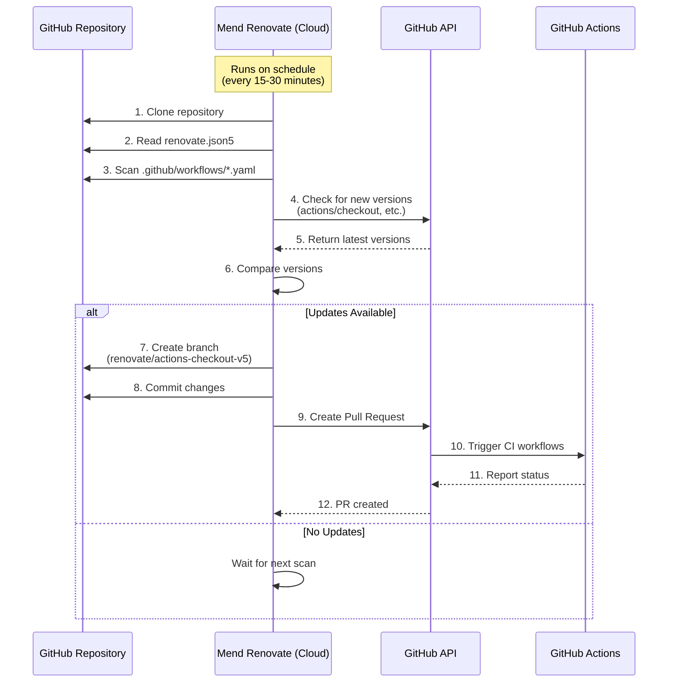
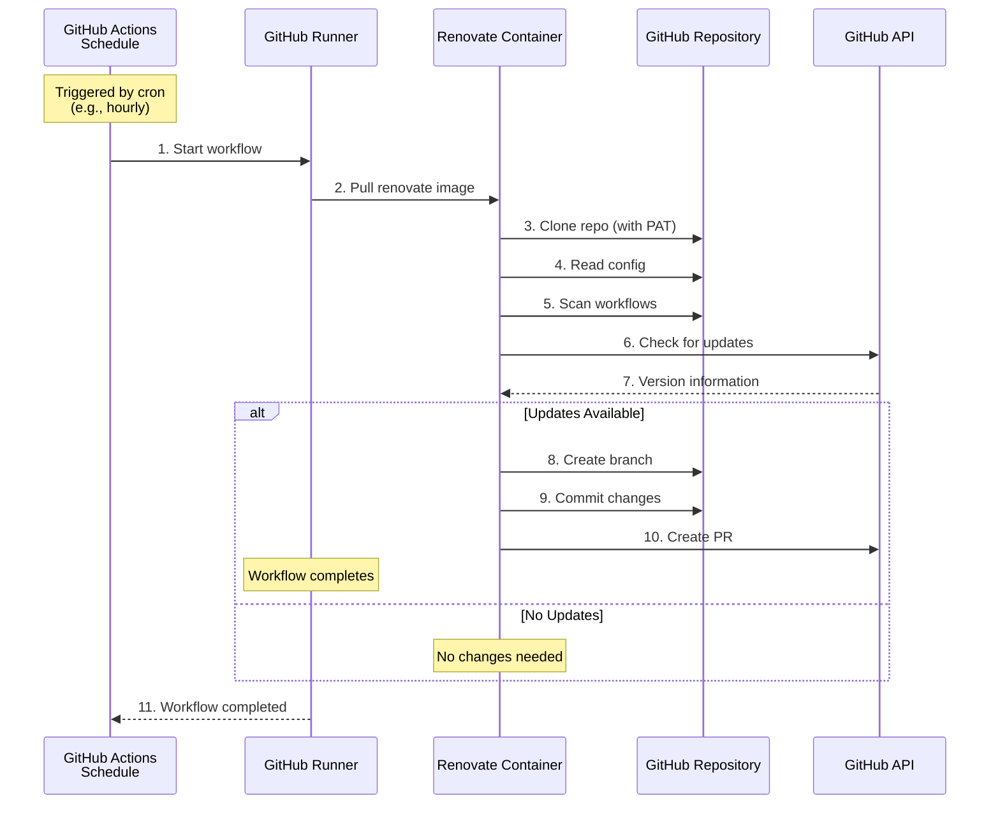
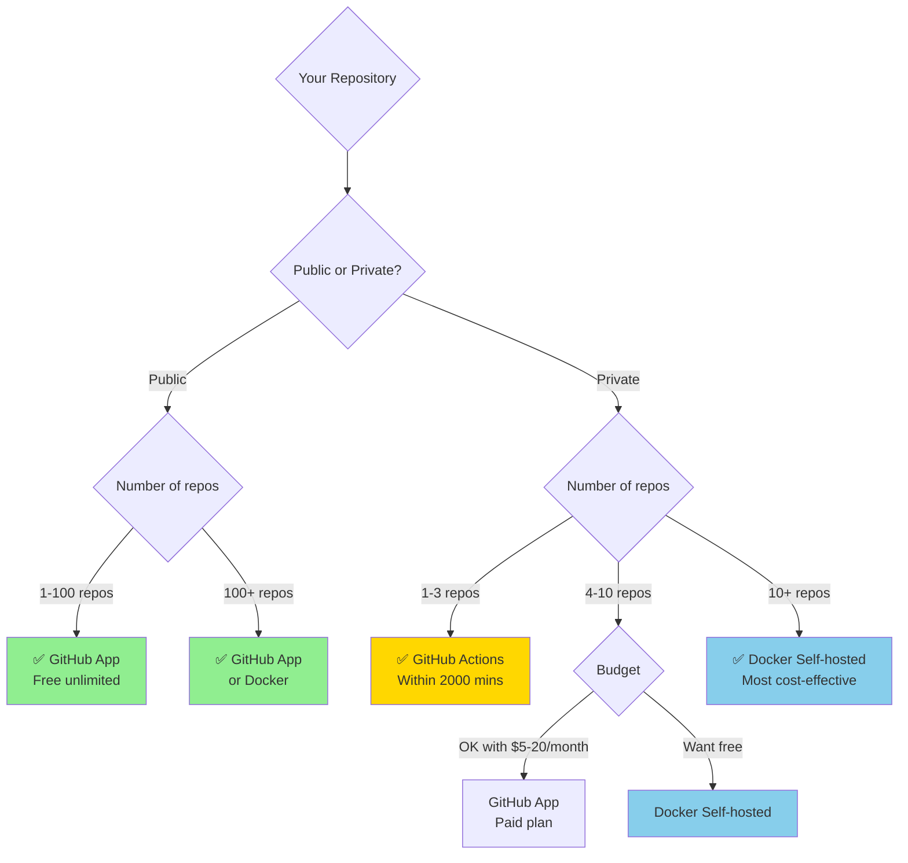

# Renovate App - Automated Dependency Updates

> 📖 **Language:** [English](DOCS.md) | [Tiếng Việt](README.md)

Demo repository for setting up and testing Renovate bot to automatically update GitHub Actions dependencies.

## 📋 Table of Contents

- [How It Works](#-how-it-works)
- [Current Configuration](#️-current-configuration)
- [Comparison: GitHub App vs Self-hosted](#-comparison-github-app-vs-self-hosted)
- [Setup Guide](#-setup-guide)
- [Troubleshooting](#-troubleshooting)
- [References](#-references)

---

## 🔄 How It Works

### Renovate Overview Flow



### Detailed Flow: GitHub App (Mend Renovate)



### Detailed Flow: Self-hosted with GitHub Actions



### Managed Workflow Dependencies

```mermaid
graph LR
    subgraph "Repository"
        A[.github/workflows/ci.yaml]
        B[.github/workflows/docker.yaml]
    end
    
    subgraph "Renovate Scans"
        A --> A1[actions/checkout@v4]
        A --> A2[actions/setup-node@v4]
        A --> A3[pnpm/action-setup@v3]
        
        B --> B1[actions/checkout@v4]
        B --> B2[docker/setup-buildx-action@v3]
        B --> B3[docker/build-push-action@v5]
    end
    
    subgraph "Renovate Actions"
        A1 --> PR1[PR: Update to v5]
        A2 --> PR2[PR: Update if available]
        A3 --> PR3[PR: Pin digest + update]
        B2 --> PR4[PR: Update to v4]
        B3 --> PR5[PR: Update to v6]
    end
    
    style PR1 fill:#90EE90
    style PR2 fill:#FFD700
    style PR3 fill:#87CEEB
    style PR4 fill:#90EE90
    style PR5 fill:#FFD700
```

---

## ⚙️ Current Configuration

### File: `renovate.json5`

```json5
{
  // Extend base config from Cybozu
  extends: ["github>cybozu/renovate-config", ":prConcurrentLimitNone"],
  
  // ONLY enable GitHub Actions manager
  enabledManagers: ["github-actions"],
  
  packageRules: [
    {
      description: "Disable automerge for all GitHub Actions updates (require manual review)",
      matchManagers: ["github-actions"],
      automerge: false,
    },
  ],
}
```

### How It Works:

| Configuration | Explanation | Impact |
|--------------|-------------|---------|
| `extends: ["github>cybozu/renovate-config"]` | Inherit base config from Cybozu | Pin digests for third-party actions, Asia/Tokyo timezone |
| `:prConcurrentLimitNone` | No limit on concurrent PRs | Can create multiple update PRs simultaneously |
| `enabledManagers: ["github-actions"]` | **Only** scan GitHub Actions | Ignores npm, Docker, terraform, etc. |
| `automerge: false` | Disable automerge | All PRs require manual review |

### Managed Dependencies:

✅ **Will be updated:**
```yaml
# ci.yaml
- uses: actions/checkout@v4           # → v5 when available
- uses: actions/setup-node@v4         # → v5 when available
- uses: pnpm/action-setup@v3          # → pin digest + update

# docker.yaml
- uses: actions/checkout@v4           # → v5 when available
- uses: docker/setup-buildx-action@v3 # → v4 when available
- uses: docker/build-push-action@v5   # → v6 when available
```

❌ **Will NOT be managed** (only github-actions enabled):
- `package.json` dependencies
- `Dockerfile` base images
- `docker-compose.yml` images
- Terraform modules

---

## 📊 Comparison: GitHub App vs Self-hosted

### Comprehensive Comparison Table

| Criteria | GitHub App (Mend) | GitHub Actions Self-hosted | Docker Self-hosted | 📚 References |
|----------|-------------------|---------------------------|-------------------|---------------|
| **💰 Cost** | ✅ Free (public)<br>💰 Paid (private) | ✅ Free (public unlimited)<br>✅ 2000 mins/month (private)<br>💰 $0.008/min overage | ✅ Free<br>💰 Server costs | [GitHub Pricing](https://docs.github.com/en/billing/managing-billing-for-github-actions/about-billing-for-github-actions)<br>[Mend Pricing](https://www.mend.io/renovate/) |
| **🔧 Setup** | ✅ **3 clicks**<br>Zero code | ⚠️ Medium<br>Workflow + PAT required | ⚠️ Complex<br>Config + infrastructure | [Mend Install](https://github.com/apps/renovate)<br>[GitHub Action](https://github.com/renovatebot/github-action)<br>[Self-hosting](https://docs.renovatebot.com/self-hosting/) |
| **⚙️ Infrastructure** | ✅ Not required<br>Mend hosted | ✅ GitHub runners | ❌ Requires 24/7 server | [GitHub Runners](https://docs.github.com/en/actions/using-github-hosted-runners/about-github-hosted-runners) |
| **🔐 Authentication** | ✅ Auto OAuth | ⚠️ Manual PAT | ⚠️ Manual PAT | [PAT Guide](https://docs.github.com/en/authentication/keeping-your-account-and-data-secure/creating-a-personal-access-token) |
| **📈 Scale** | ✅ **Unlimited repos**<br>One-click bulk enable | ⚠️ 1 workflow per repo | ✅ Unlimited<br>Autodiscover | [Autodiscover](https://docs.renovatebot.com/self-hosting/#autodiscover) |
| **⏱️ Frequency** | ✅ ~15-30 minutes | ⚠️ Cron-based<br>(hourly, daily) | ✅ Customizable | [Cron Schedule](https://docs.github.com/en/actions/using-workflows/events-that-trigger-workflows#schedule) |
| **🎛️ Dashboard** | ✅ **Beautiful web UI**<br>Settings, logs, insights | ❌ None<br>Only Actions logs | ❌ None | [Mend Dashboard](https://developer.mend.io/) |
| **🐛 Debugging** | ⚠️ Difficult<br>Via dashboard | ✅ Easy<br>Actions logs | ✅ **Easiest**<br>Full log access | [Debug Guide](https://docs.renovatebot.com/troubleshooting/) |
| **🔒 Security** | ⚠️ Third-party access | ✅ Good<br>Encrypted secrets | ✅ **Best**<br>Full control | [Security](https://docs.github.com/en/actions/security-guides) |
| **🌐 Platforms** | ✅ GitHub, GitLab,<br>Bitbucket, Azure | ❌ GitHub only | ✅ All platforms | [Platforms](https://docs.renovatebot.com/modules/platform/) |
| **📊 Usage Limits** | ⚠️ Mend rate limits | ⚠️ **2000 mins/month**<br>(private repos) | ✅ No limits<br>(except API) | [Usage Limits](https://docs.github.com/en/billing/managing-billing-for-github-actions/about-billing-for-github-actions#usage-limits) |
| **🎨 Customization** | ⚠️ Config file only | ✅ Workflow customizable | ✅ **Fully flexible** | [Config Options](https://docs.renovatebot.com/configuration-options/) |
| **👥 Multi-repo** | ✅ **Best**<br>Bulk enable | ❌ Copy workflow per repo | ✅ Good<br>Single job manages all | [Multi-repo](https://docs.renovatebot.com/self-hosting/#repositories) |
| **⚡ Performance** | ✅ **Fast**<br>Mend's infrastructure | ⚠️ Depends on Actions<br>May queue | ✅ Depends on server | N/A |
| **🆘 Support** | ✅ Mend support team | ⚠️ Community only | ⚠️ Community only | [Support](https://github.com/renovatebot/renovate/discussions) |

### GitHub Actions Cost Details

#### ✅ Public Repositories:
```
✓ UNLIMITED minutes - Completely free
✓ No limits even if running 24/7
```

#### ⚠️ Private Repositories:

| Plan | Free Minutes | Overage Rate | Storage |
|------|-------------|-------------|---------|
| Free | 2,000 mins/month | $0.008/min | 500 MB |
| Pro | 3,000 mins/month | $0.008/min | 1 GB |
| Team | 3,000 mins/month | $0.008/min | 2 GB |
| Enterprise | 50,000 mins/month | $0.008/min | 50 GB |

📚 **Reference:** [GitHub Actions Billing](https://docs.github.com/en/billing/managing-billing-for-github-actions/about-billing-for-github-actions)

#### 💵 Cost Calculation Examples:

**Scenario 1: 1 private repo, hourly runs**
```
Per run: 5 minutes
Runs per day: 24
Runs per month: 24 × 30 = 720 runs
Total minutes: 720 × 5 = 3,600 minutes

Free tier: 2,000 minutes
Overage: 3,600 - 2,000 = 1,600 minutes
Cost: 1,600 × $0.008 = $12.80/month
```

**Scenario 2: 5 private repos, every 6 hours**
```
Per repo: 4 runs/day
5 repos: 4 × 5 × 30 = 600 runs/month
Total minutes: 600 × 5 = 3,000 minutes

Free tier: 2,000 minutes
Overage: 1,000 minutes
Cost: 1,000 × $0.008 = $8/month
```

#### 💡 How to Save Minutes:

```yaml
# Instead of hourly (720 runs/month):
- cron: '0 * * * *'

# Every 6 hours (120 runs/month - saves 83%):
- cron: '0 */6 * * *'

# Weekdays only (22 runs/month - saves 97%):
- cron: '0 9 * * 1-5'
```

---

## 🎯 When to Use Each Method?



### ✅ Use GitHub App (Mend) when:
- ✨ Public repos (free unlimited)
- 🏢 Multiple repos (5+) need quick enabling
- 👥 Team/Organization setup
- 🚀 Want quick setup, no maintenance
- 📊 Need beautiful dashboard
- ⏱️ Need real-time updates

### ✅ Use GitHub Actions when:
- 💰 Few private repos (1-5)
- ⚖️ Balance between easy setup and control
- 📈 Within 2000 minutes/month limit
- 🔐 Want to manage tokens yourself

### ✅ Use Docker Self-hosted when:
- 🏢 Enterprise with many repos (10+)
- 🌐 Multi-platform (GitHub + GitLab)
- 🛡️ Strict security requirements (on-premise)
- 📊 Frequent runs (every 15 minutes)
- 💪 Have existing infrastructure

---

## 🚀 Setup Guide

### Option 1: GitHub App (Recommended)

1. **Install Mend Renovate App:**
   ```
   https://github.com/apps/renovate
   ```

2. **Grant permissions:**
   - Select repositories
   - Grant read/write access

3. **Configure settings:**
   - Visit: https://developer.mend.io/
   - Enable "Dependency Updates"
   - Enable "Automated PRs"
   - Enable "Create onboarding PRs"

4. **Add config file** (already have `renovate.json5`)

5. **Wait for Renovate:**
   - Onboarding PR appears in ~15 minutes
   - After merge, Renovate scans and creates update PRs

📚 **Docs:** https://docs.renovatebot.com/getting-started/installing-onboarding/

---

### Option 2: GitHub Actions Self-hosted

1. **Create Personal Access Token:**
   ```
   GitHub Settings → Developer settings → Personal access tokens
   → Generate new token (classic)
   
   Required scopes:
   ✓ repo (full)
   ✓ workflow
   ```

2. **Add token to repository secrets:**
   ```
   Repository Settings → Secrets and variables → Actions
   → New repository secret
   
   Name: RENOVATE_TOKEN
   Value: ghp_xxxxxxxxxxxxx
   ```

3. **Create workflow file:**

```yaml
# .github/workflows/renovate.yml
name: Renovate

on:
  schedule:
    # Run every 6 hours
    - cron: '0 */6 * * *'
  workflow_dispatch:
    # Allow manual trigger

jobs:
  renovate:
    runs-on: ubuntu-latest
    steps:
      - name: Checkout
        uses: actions/checkout@v4

      - name: Self-hosted Renovate
        uses: renovatebot/github-action@v40.3.2
        with:
          configurationFile: renovate.json5
          token: ${{ secrets.RENOVATE_TOKEN }}
        env:
          RENOVATE_REPOSITORIES: ${{ github.repository }}
          LOG_LEVEL: debug
```

4. **Commit and push:**
   ```bash
   git add .github/workflows/renovate.yml
   git commit -m "chore: add self-hosted renovate workflow"
   git push
   ```

5. **Test:**
   - Go to "Actions" tab
   - Select "Renovate" workflow
   - Click "Run workflow"

📚 **Docs:** https://github.com/renovatebot/github-action

---

### Option 3: Docker Self-hosted

1. **Create config file:**

```javascript
// config.js
module.exports = {
  platform: 'github',
  endpoint: 'https://api.github.com/',
  token: process.env.GITHUB_TOKEN,
  
  repositories: ['thuan-ngo/renovate-app'],
  
  onboarding: true,
  requireConfig: 'optional',
  
  gitAuthor: 'Renovate Bot <bot@renovateapp.com>',
  
  logLevel: 'info',
  logFile: 'renovate.log',
};
```

2. **Run with Docker:**

```bash
docker run --rm \
  -e GITHUB_TOKEN=ghp_xxxxxxxxxxxxx \
  -e LOG_LEVEL=debug \
  -v $(pwd)/config.js:/usr/src/app/config.js \
  renovate/renovate:latest
```

3. **Setup cron job (optional):**

```bash
# Create script
cat > ~/renovate-run.sh << 'EOF'
#!/bin/bash
docker run --rm \
  -e GITHUB_TOKEN=ghp_xxxxxxxxxxxxx \
  -v ~/renovate-config.js:/usr/src/app/config.js \
  renovate/renovate:latest
EOF

chmod +x ~/renovate-run.sh

# Add to crontab (every 6 hours)
crontab -e
0 */6 * * * ~/renovate-run.sh >> ~/renovate.log 2>&1
```

📚 **Docs:** https://docs.renovatebot.com/self-hosting/

---

## 🔍 Troubleshooting

### ❌ Issue: Renovate Not Creating PRs

**Possible causes:**

1. **Workflows not in correct location:**
   ```bash
   # Wrong:
   workflows/ci.yaml
   
   # Correct:
   .github/workflows/ci.yaml
   ```

2. **No updates needed:**
   - Check: All actions already at latest version
   - Solution: Wait for new versions or test by downgrading

3. **Invalid config file:**
   ```bash
   # Test config locally
   npm install -g renovate
   renovate --dry-run=full thuan-ngo/renovate-app
   ```

4. **Onboarding PR not merged:**
   - Find PR titled "Configure Renovate"
   - Merge or close it

5. **Repository not enabled:**
   - Check: https://developer.mend.io/
   - Enable "Dependency Updates"

### ❌ Issue: GitHub Actions Workflow Not Running

**Check:**

1. **Token has correct permissions:**
   ```
   ✓ repo (full control)
   ✓ workflow
   ```

2. **Secret added correctly:**
   ```
   Settings → Secrets → Actions → RENOVATE_TOKEN
   ```

3. **Cron syntax correct:**
   ```yaml
   # Correct:
   - cron: '0 */6 * * *'
   
   # Wrong:
   - cron: '0 6 * * *'  # Only runs once per day
   ```

4. **Check logs:**
   ```
   Actions tab → Renovate workflow → Latest run → Logs
   ```

### ❌ Issue: PR Created but CI Fails

**Solutions:**

1. **Fix CI workflow:**
   - Ensure dependencies installed
   - Fix test commands

2. **Allow CI on Renovate PRs:**
   ```yaml
   on:
     pull_request:
       branches: ['**']  # Allow all branches
   ```

3. **Check Renovate branch naming:**
   ```yaml
   on:
     pull_request:
       branches:
         - main
         - 'renovate/**'  # Allow Renovate branches
   ```

---

## 📚 References

### Official Documentation:
- **Renovate Docs:** https://docs.renovatebot.com/
- **GitHub Actions:** https://docs.github.com/en/actions
- **Mend Renovate:** https://www.mend.io/renovate/
- **Renovate GitHub App:** https://github.com/apps/renovate

### Configuration:
- **Configuration Options:** https://docs.renovatebot.com/configuration-options/
- **GitHub Actions Manager:** https://docs.renovatebot.com/modules/manager/github-actions/
- **Package Rules:** https://docs.renovatebot.com/configuration-options/#packagerules
- **Preset Configs:** https://docs.renovatebot.com/presets-default/

### Self-hosting:
- **Self-hosting Guide:** https://docs.renovatebot.com/self-hosting/
- **GitHub Action:** https://github.com/renovatebot/github-action
- **Docker Hub:** https://hub.docker.com/r/renovate/renovate
- **Running Renovate:** https://docs.renovatebot.com/self-hosting/#running-renovate

### Pricing & Billing:
- **GitHub Actions Pricing:** https://docs.github.com/en/billing/managing-billing-for-github-actions/about-billing-for-github-actions
- **Usage Limits:** https://docs.github.com/en/billing/managing-billing-for-github-actions/about-billing-for-github-actions#usage-limits
- **Mend Renovate Pricing:** https://www.mend.io/renovate/

### Security:
- **Security Best Practices:** https://docs.renovatebot.com/self-hosting/#security
- **GitHub Secrets:** https://docs.github.com/en/actions/security-guides/encrypted-secrets
- **PAT Security:** https://docs.github.com/en/authentication/keeping-your-account-and-data-secure/creating-a-personal-access-token

### Community & Support:
- **GitHub Discussions:** https://github.com/renovatebot/renovate/discussions
- **GitHub Issues:** https://github.com/renovatebot/renovate/issues
- **Stack Overflow:** https://stackoverflow.com/questions/tagged/renovate
- **Discord Community:** https://discord.gg/renovate

### Related Projects:
- **Cybozu Renovate Config:** https://github.com/cybozu/renovate-config
- **Renovate Config Validator:** https://docs.renovatebot.com/config-validation/

---

## 🏗️ Repository Structure

```
renovate-app/
├── .github/
│   └── workflows/
│       ├── ci.yaml           # CI workflow with GitHub Actions
│       └── docker.yaml       # Docker build workflow
├── renovate.json5            # Renovate configuration
├── README.md                 # Vietnamese documentation
└── DOCS.md                   # This file (English documentation)
```

---

## 📈 Monitoring & Analytics

### Via Mend Dashboard:
- **URL:** https://developer.mend.io/
- **Features:**
  - View all managed repositories
  - Check update status
  - See PR history
  - Monitor dependency health
  - Configure repository settings

### Via GitHub Actions:
- **Location:** Repository → Actions tab → Renovate workflow
- **Features:**
  - View run history
  - Check logs
  - See execution time
  - Monitor failures
  - Manual trigger

---

## 🔐 Security Considerations

### GitHub App:
- ✅ OAuth-based authentication
- ✅ Granular permissions
- ⚠️ Third-party access to repositories
- ✅ Can be revoked anytime
- ✅ Audit logs available

### Self-hosted:
- ✅ Full control over token
- ✅ No third-party access
- ⚠️ Requires secure token storage
- ✅ Can restrict network access
- ✅ Complete audit trail

### Best Practices:
1. Use fine-grained PATs when possible
2. Rotate tokens regularly
3. Limit token scopes to minimum required
4. Enable 2FA on GitHub account
5. Review Renovate PRs before merging
6. Enable branch protection rules
7. Require status checks before merge

---

## 🎓 Learning Resources

### Beginner:
- [What is Renovate?](https://docs.renovatebot.com/)
- [Getting Started Tutorial](https://docs.renovatebot.com/tutorial/)
- [Configuration Basics](https://docs.renovatebot.com/getting-started/running/)

### Intermediate:
- [Package Rules Deep Dive](https://docs.renovatebot.com/configuration-options/#packagerules)
- [Scheduling Updates](https://docs.renovatebot.com/presets-schedule/)
- [Automerge Configuration](https://docs.renovatebot.com/key-concepts/automerge/)

### Advanced:
- [Self-hosting Production Setup](https://docs.renovatebot.com/self-hosting/)
- [Custom Managers](https://docs.renovatebot.com/modules/manager/)
- [Regex Manager](https://docs.renovatebot.com/modules/manager/regex/)

---

## 🤝 Contributing

Contributions are welcome! Please feel free to submit a Pull Request.

### How to Contribute:
1. Fork the repository
2. Create a feature branch (`git checkout -b feature/amazing-feature`)
3. Commit your changes (`git commit -m 'Add amazing feature'`)
4. Push to the branch (`git push origin feature/amazing-feature`)
5. Open a Pull Request

---

## 📝 License

MIT License - see LICENSE file for details

---

## 📞 Contact

For questions or support:
- Open an issue on GitHub
- Visit Renovate discussions: https://github.com/renovatebot/renovate/discussions

---

**Last Updated:** October 2024  
**Renovate Version:** Latest  
**Documentation Version:** 1.0.0